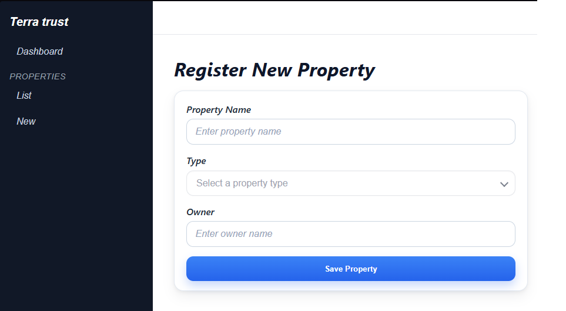

# 🌍 Terra Trust Web

**Terra Trust Web** is the front-end application for the Terra Trust platform, built with **Angular**.  
It provides a user interface for property management operations, including property creation, listing, and other related features.

---

## 📂 Project Structure

```
TERRA-TRUST-WEB/
│
├── src/
│   ├── app/
│   │   ├── assets/
│   │   │   └── img/                 # Application images and icons
│   │   ├── components/              # Reusable UI components
│   │   ├── core/                     # Core services, interceptors, and guards
│   │   ├── enums/                    # Application enums
│   │   ├── environments/             # Environment configs (dev/prod)
│   │   ├── interfaces/               # TypeScript interfaces and models
│   │   ├── pages/                     # Application pages (views)
│   │   ├── service/                   # Business logic and API calls
│   │   ├── shared/                    # Shared components and modules
│   │   ├── app.component.*            # Root component
│   │   ├── app.config.ts              # App configuration
│   │   ├── app.routes.ts              # Angular routing
│   ├── index.html
│   ├── main.ts
│   ├── styles.css                     # Global styles
│
├── angular.json                       # Angular CLI configuration
├── package.json                       # Dependencies and scripts
└── README.md
```

---

## 🚀 Getting Started

### 1️⃣ Prerequisites
Make sure you have the following installed:
- [Node.js](https://nodejs.org/) (LTS recommended)
- [Angular CLI](https://angular.io/cli)

```bash
npm install -g @angular/cli
```

---

### 2️⃣ Installation
Clone the repository and install dependencies:

```bash
git clone https://github.com/your-username/TERRA-TRUST-WEB.git
cd TERRA-TRUST-WEB
npm install
```

---

### 3️⃣ Running the Application
Start the development server:

```bash
ng serve
```

Then open your browser at:
```
http://localhost:4200
```

---

### 4️⃣ Build for Production
To generate a production build:

```bash
ng build --configuration production
```

The compiled files will be located in the `dist/` folder.

---

## 📸 Screenshots

| Create Property | Property List |
|-----------------|---------------|
|  |  |

---

## 🛠 Tech Stack
- **Framework:** Angular 18
- **Language:** TypeScript
- **Styling:** CSS
- **Build Tool:** Angular CLI
- **Package Manager:** npm

---

## 📌 Features
- Create new properties with relevant details
- List and manage registered properties
- Organized folder structure for scalability
- Reusable UI components and services
- Environment-based configuration

---

